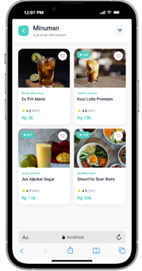
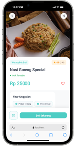

# MyShop Mini - Flutter E-Commerce Application


## 📱 Tentang Aplikasi

**MyShop Mini** adalah aplikasi e-commerce mobile yang dibangun menggunakan Flutter. Aplikasi ini menyediakan pengalaman berbelanja yang mudah, cepat, dan intuitif dengan desain UI yang modern dan responsive.

### Fitur Utama:
- 🏠 **Home Screen** - Tampilan kategori produk dengan search bar
- 📦 **Product List** - Grid view produk dengan informasi lengkap
- 🔍 **Product Detail** - Halaman detail produk yang informatif
- ⭐ **Rating & Reviews** - Sistem rating dan ulasan produk
- 💰 **Price Display** - Tampilan harga yang jelas dan menarik
- 🎨 **Modern UI** - Desain clean dengan color scheme yang konsisten

---

## 📸 Screenshot Aplikasi

### Home Screen

*Halaman utama dengan kategori Makanan, Minuman, dan Elektronik*

### Product List Screen

*Grid view menampilkan produk dengan rating dan harga*

### Product Detail Screen

*Detail produk lengkap dengan fitur unggulan dan informasi*

---

## 🏗️ Struktur Aplikasi

```
MyShop Mini
├── Home Screen
│   ├── Header (Menu + Profile)
│   ├── Search Bar
│   └── Category List
│       ├── Makanan (4 produk)
│       ├── Minuman (4 produk)
│       └── Elektronik (4 produk)
│
├── Product List Screen
│   ├── Header (Back + Title + Filter)
│   └── Product Grid (2 kolom)
│       ├── Product Image
│       ├── Brand
│       ├── Product Name
│       ├── Rating & Reviews
│       └── Price
│
└── Product Detail Screen
    ├── Top Navigation (Back + Share)
    ├── Product Image (Full Width)
    ├── Product Info
    │   ├── Brand & Rating Badge
    │   ├── Product Name
    │   ├── Stock Status
    │   └── Price
    ├── Features Section
    ├── Description Section
    ├── Product Info Grid
    └── Bottom Action (Cart + Buy Button)
```

---

## 🎨 Widget Yang Digunakan

### **1. Layout Widgets**

| Widget | Fungsi | Lokasi Penggunaan |
|--------|--------|-------------------|
| `MaterialApp` | Root widget aplikasi, mengatur theme dan routing | main.dart |
| `Scaffold` | Struktur dasar halaman dengan body | Semua screen |
| `SafeArea` | Menghindari area notch/status bar | Semua screen |
| `Column` | Menyusun widget secara vertikal | Semua screen |
| `Row` | Menyusun widget secara horizontal | Header, badges, buttons |
| `Stack` | Menumpuk widget di atas satu sama lain | Product images, top navigation |
| `Positioned` | Menempatkan widget pada posisi spesifik dalam Stack | Badges, navigation buttons |
| `Expanded` | Membuat widget mengisi ruang yang tersedia | Product name, description |
| `SingleChildScrollView` | Membuat konten scrollable | Home Screen, Product Detail |
| `Padding` | Memberikan jarak dalam widget | Semua screen |
| `Container` | Widget serbaguna untuk styling dan layout | Cards, buttons, badges |
| `SizedBox` | Memberikan jarak/spacing antar widget | Semua screen |

### **2. Grid & List Widgets**

| Widget | Fungsi | Lokasi Penggunaan |
|--------|--------|-------------------|
| `GridView.builder` | Membuat grid dinamis untuk produk | Product List Screen |
| `SliverGridDelegateWithFixedCrossAxisCount` | Mengatur jumlah kolom dan spacing grid | Product List Screen |
| `ListView` (via map) | Membuat list kategori | Home Screen |
| `Wrap` | Membuat layout flexibel untuk features | Product Detail Screen |

### **3. Display Widgets**

| Widget | Fungsi | Lokasi Penggunaan |
|--------|--------|-------------------|
| `Text` | Menampilkan teks | Semua screen |
| `Icon` | Menampilkan icon | Navigation, features, info |
| `Image` (NetworkImage) | Menampilkan gambar dari URL | Product images |
| `CircleAvatar` | Menampilkan avatar berbentuk lingkaran | Profile icon |

### **4. Input & Interaction Widgets**

| Widget | Fungsi | Lokasi Penggunaan |
|--------|--------|-------------------|
| `TextField` | Input text untuk search | Home Screen |
| `GestureDetector` | Mendeteksi tap/touch pada widget | Category cards, product cards |
| `ElevatedButton` | Tombol dengan elevasi | Buy button |
| `IconButton` | Tombol icon | Favorite button |

### **5. Navigation Widgets**

| Widget | Fungsi | Lokasi Penggunaan |
|--------|--------|-------------------|
| `Navigator.push` | Navigasi ke halaman baru | Transisi antar screen |
| `Navigator.pop` | Kembali ke halaman sebelumnya | Back button |
| `MaterialPageRoute` | Route untuk transisi halaman | Semua navigasi |

### **6. Styling & Decoration**

| Widget/Property | Fungsi | Lokasi Penggunaan |
|-----------------|--------|-------------------|
| `BoxDecoration` | Styling container (border, shadow, gradient) | Cards, buttons, badges |
| `BorderRadius` | Membuat sudut melengkung | Cards, buttons, containers |
| `BoxShadow` | Memberikan efek bayangan | Cards, buttons |
| `LinearGradient` | Efek gradien warna | Profile avatar, image overlay |
| `Border` | Memberikan border pada widget | Feature chips, cart button |

### **7. Responsive Widgets**

| Widget/Method | Fungsi | Lokasi Penggunaan |
|---------------|--------|-------------------|
| `MediaQuery` | Mendapatkan ukuran layar device | Semua screen |
| `MediaQuery.of(context).size.width` | Mendapatkan lebar layar | Responsive padding & font size |
| `MediaQuery.of(context).size.height` | Mendapatkan tinggi layar | Image height |

### **8. Feedback Widgets**

| Widget | Fungsi | Lokasi Penggunaan |
|--------|--------|-------------------|
| `SnackBar` | Notifikasi sementara | Product Detail (setelah add to cart) |
| `ScaffoldMessenger` | Menampilkan SnackBar | Product Detail Screen |

---

## 🎨 Color Palette

```dart
Primary Color:    #4ECDC4 (Cyan/Turquoise)
Secondary Color:  #FF6B6B (Red/Pink)
Accent Color:     #95E1D3 (Light Cyan)
Text Primary:     #2D3748 (Dark Gray)
Text Secondary:   #718096 (Medium Gray)
Text Tertiary:    #CBD5E0 (Light Gray)
Background:       #F8F9FA (Off White)
Success:          #48BB78 (Green)
Warning:          #FFA726 (Orange)
```

---

## 📊 Data Models

### **Category Model**
```dart
class Category {
  final String name;           // Nama kategori
  final IconData icon;         // Icon kategori
  final Color color;           // Warna tema kategori
  final int productCount;      // Jumlah produk
}
```

### **Product Model**
```dart
class Product {
  final String name;           // Nama produk
  final String category;       // Kategori produk
  final double price;          // Harga produk
  final String imageUrl;       // URL gambar produk
  final String description;    // Deskripsi lengkap
  final double rating;         // Rating (1-5)
  final int reviews;           // Jumlah ulasan
  final String brand;          // Merek/brand
  final List<String> features; // Fitur unggulan
  final bool inStock;          // Status ketersediaan
}
```

---

## 🚀 Cara Menjalankan Aplikasi

### Prerequisites
- Flutter SDK (2.0 atau lebih baru)
- Dart SDK
- Android Studio / VS Code
- Emulator atau Device fisik

### Langkah-langkah:

1. **Clone atau Download Project**
   ```bash
   git clone <repository-url>
   cd myshop_mini
   ```

2. **Install Dependencies**
   ```bash
   flutter pub get
   ```

3. **Jalankan Aplikasi**
   ```bash
   flutter run
   ```

4. **Build APK (Optional)**
   ```bash
   flutter build apk --release
   ```

---

## 📁 Struktur File

```
myshop_mini/
│
├── lib/
│   └── main.dart              # File utama aplikasi
│
├── assets/
│   └── images/
│       ├── sc1.png            # Screenshot Home
│       ├── sc2.png            # Screenshot Product List
│       └── sc3.png            # Screenshot Product Detail
│
├── pubspec.yaml               # Dependencies
└── README.md                  # Dokumentasi
```

---

## 🎯 Fitur Detail Per Screen

### **Home Screen**
- ✅ Responsive header dengan menu dan profile
- ✅ Search bar dengan icon filter
- ✅ Category cards dengan:
  - Icon kategori
  - Nama kategori
  - Jumlah produk tersedia
  - Arrow indicator
- ✅ Smooth navigation ke Product List

### **Product List Screen**
- ✅ Header dengan back button dan filter
- ✅ Responsive grid (2 kolom mobile, 3 kolom tablet)
- ✅ Product card menampilkan:
  - Gambar produk
  - Badge rating (untuk produk rating ≥4.7)
  - Favorite button
  - Brand name
  - Product name (max 2 baris)
  - Rating & reviews count
  - Formatted price (25k, 4.5jt)
- ✅ Consistent spacing (15px)
- ✅ Smooth scroll

### **Product Detail Screen**
- ✅ Full-width image header dengan gradient overlay
- ✅ Transparent top navigation (back + share)
- ✅ Product information:
  - Brand badge
  - Rating badge dengan warna
  - Product name (large)
  - Stock status indicator
  - Large price display
  - Favorite button
- ✅ **Features Section** - Chip badges untuk fitur unggulan
- ✅ **Description Section** - Deskripsi lengkap produk
- ✅ **Product Info Grid** - Informasi terstruktur:
  - Kategori
  - Brand
  - Rating
  - Reviews
  - Status stok
- ✅ **Bottom Action Bar**:
  - Cart button (outline)
  - Buy Now button (filled)
- ✅ Success SnackBar setelah add to cart

---

## 🎨 Design Principles

### **Responsiveness**
- Menggunakan `MediaQuery` untuk dynamic sizing
- Font size berdasarkan persentase screen width
- Padding dinamis (5% dari lebar layar)
- Grid columns adaptive (2 untuk mobile, 3 untuk tablet)

### **Consistency**
- Color scheme konsisten di semua screen
- Border radius standar (12-20px)
- Shadow effect uniform
- Spacing konsisten (8, 12, 15, 20, 25px)

### **User Experience**
- Smooth navigation transitions
- Visual feedback (SnackBar)
- Clear information hierarchy
- Easy-to-tap buttons (minimum 44px)
- Readable font sizes

### **Modern UI**
- Clean and minimal design
- Card-based layout
- Rounded corners
- Subtle shadows
- Icon-based navigation
- Badge indicators
- Gradient effects

---

## 🔧 Customization

### **Mengganti Gambar Produk**
Edit URL di `products` list:
```dart
Product(
  name: 'Nama Produk',
  imageUrl: 'https://your-image-url.com/image.jpg',
  ...
)
```

### **Menambah Kategori Baru**
Tambahkan di `categories` list:
```dart
Category(
  name: 'Kategori Baru',
  icon: Icons.category_icon,
  color: Color(0xFFHEXCODE),
  productCount: 0,
)
```

### **Menambah Produk Baru**
Tambahkan di `products` list:
```dart
Product(
  name: 'Produk Baru',
  category: 'Nama Kategori',
  price: 50000,
  imageUrl: 'https://...',
  description: 'Deskripsi lengkap...',
  rating: 4.5,
  reviews: 100,
  brand: 'Brand Name',
  features: ['Feature 1', 'Feature 2', 'Feature 3'],
  inStock: true,
)
```

### **Mengubah Warna Tema**
Edit di `ThemeData` atau color constants:
```dart
Color primaryColor = Color(0xFF4ECDC4);  // Ganti dengan warna pilihan
```

---

## 📱 Responsiveness Details

### **Breakpoints**
- **Mobile**: < 600px (2 kolom grid)
- **Tablet**: ≥ 600px (3 kolom grid)

### **Dynamic Elements**
- Title font: 8.5% dari screen width
- Subtitle font: 3.8% dari screen width
- Horizontal padding: 5% dari screen width
- Image height: 45% dari screen height
- Grid aspect ratio: 0.68 (mobile), 0.7 (tablet)

---

## 🐛 Troubleshooting

### **Gambar tidak muncul**
- Pastikan URL gambar valid dan accessible
- Check internet connection
- Coba gunakan gambar lokal dari assets

### **Error build**
```bash
flutter clean
flutter pub get
flutter run
```

### **Layout overflow**
- Check `SingleChildScrollView` sudah digunakan
- Pastikan `Expanded` digunakan dengan benar
- Verifikasi `MediaQuery` values

---

## 📚 Resources

- [Flutter Documentation](https://flutter.dev/docs)
- [Dart Documentation](https://dart.dev/guides)
- [Material Design](https://material.io/design)
- [Flutter Widget Catalog](https://flutter.dev/docs/development/ui/widgets)

---

## 👨‍💻 Developer

Developed with ❤️ using Flutter

---

## 📄 License

This project is open source and available under the [MIT License](LICENSE).

---

## 🙏 Acknowledgments

- Images from [Unsplash](https://unsplash.com)
- Icons from [Material Icons](https://fonts.google.com/icons)
- Design inspiration from modern e-commerce apps

---

## 📞 Contact

For questions or suggestions, please reach out:
- Email: your.email@example.com
- GitHub: [@yourusername](https://github.com/yourusername)

---

**Happy Coding! 🚀**